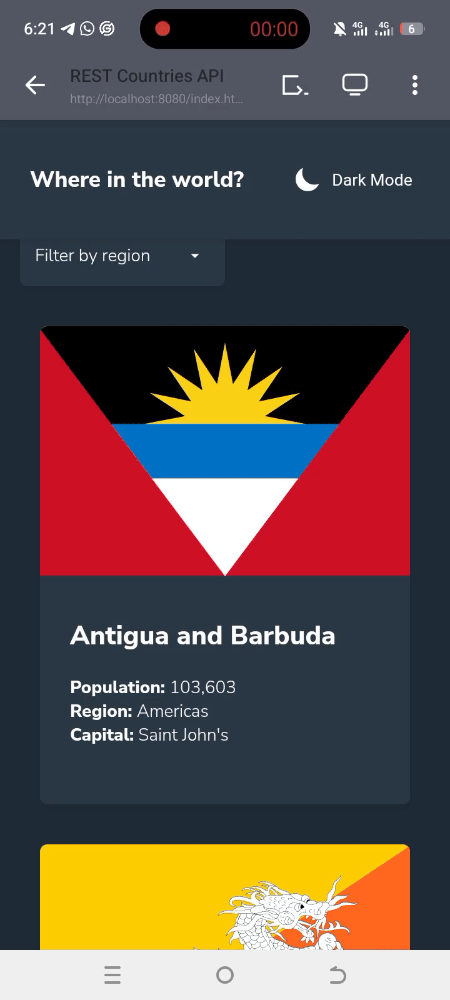

# Frontend Mentor - REST Countries API with color theme switcher solution

This is a solution to the [REST Countries API with color theme switcher challenge on Frontend Mentor](https://www.frontendmentor.io/challenges/rest-countries-api-with-color-theme-switcher-5cacc469fec04111f7b848ca).
## Table of contents

- [Overview](#overview)
  - [The challenge](#the-challenge)
  - [Added features](#added-features)
  - [Screenshot](#screenshot)
  - [Links](#links)
- [My process](#my-process)
  - [Built with](#built-with)
  - [What I learned](#what-i-learned)
  - [Continued development](#continued-development)
  - [Useful resources](#useful-resources)
- [Author](#author)
- [Acknowledgments](#acknowledgments)


## Overview
A website that integrates with the [REST Countries API](https://restcountries.com) to pull country data and display it.

### The challenge

Users should be able to:

- See all countries from the API on the homepage
- Search for a country using an `input` field
- Filter countries by region
- Click on a country to see more detailed information on a separate page
- Click through to the border countries on the detail page
- Toggle the color scheme between light and dark mode *(optional)*


### Added features
- A cancel button for when a region is selected to revert it back to "Filter by region"
- The detailed information about the country is being directed to an entirely different page
- User with dark mode on their devices meets the page in dark mode

### Screenshot



### Links

- Solution URL: (https://github.com/Mclakez/Rest-countries-API-website)
- Live Site URL: (https://rest-countries-api-website.vercel.app/)

## My process
I started by breaking down the design into components and built the layout using semantic HTML with a mobile-first approach.

The main challenge was deciding how to handle the API data. Initially, I considered fetching all country details upfront, but realized this would be too slow. After consulting the community on X and Discord, I decided to fetch basic country data on load and get detailed information only when a user clicks on a specific country.

Once the core functionality was working, I added the search, filter, and dark mode features, then made the design fully responsive for larger screens.

### Built with

- Semantic HTML5 markup
- CSS custom properties
- Flexbox
- CSS Grid
- Mobile-first workflow
- JavaScript (ES6+, Fetch API, async/await)
- LocalStorage for persistent data


### What I learned

- Data integrity vs UI rendering

- Event delegation for dynamically created elements

- API integration and error handling: Fetch countries and their parameters with proper async/await and error checks.

- The use of || in literal templates

- The use of Object.values() to get the currencies and languages ,since they are nested objects with different key value for different countries
```js
<li><span class="label">Currencies:</span> ${Object.values(country.currencies || {})[0].name || 'N/A'}</li>
        <li><span class="label">Languages:</span>${Object.values(country.languages || {}).join(', ')}</li>
```

-The use of Promise.all to run multiple fetch requests in parallel. I could have use the 'for of loop', but it was a bit slower than promise.all
```js
let responses = await Promise.all(
                  country.borders.map(border => {
                      return fetch(`https://restcountries.com/v3.1/alpha/${border}`)
                  })
              )
```

-The use of the prefers-color-scheme in the media query to check if the user device is set to dark mode
```css
@media (prefers-color-scheme: dark) {
  :root:not(.light) {
    --very-light-gray-bg: hsl(207, 26%, 17%);
    --white: hsl(209, 23%, 22%);             
    --very-dark-blue-text: hsl(0, 0%, 100%); 
    --dark-gray-input: hsl(0, 0%, 70%);
  }
  
   :root:not(.light) .theme-toggle svg {
    stroke: transparent;
    fill: white;
}

:root:not(.light) .theme-toggle {
    color: white;
}


}
```

### Continued development

- Working on how to use Promise.all better
- Working on how to use map better
- Working on how to use new Set better
- Working on how to use Object.values() better
- Refining Dark mode toggle

### Useful resources

- Claude - reference for some new things i learnt

- Scrimba Discord Channel - A community that answered some of my questions 

- Frontend Mentor Challenge – project design inspiration

## Author

GitHub: @Mclakez

Frontend Mentor: @Mclakez

Twitter: @FadairoMarvel


## Acknowledgments

-Frontend Mentor for the project design
